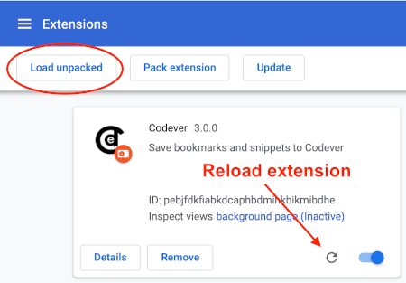

Codever Browser Extension
---
Browser extension to easily save bookmarks and code snippets from the web to [www.codever.land](https://www.codever.land),
 the Bookmarks and Code Snippets Manager for Developers & Co.
 
## Install
This browser extension is available for:

| [](https://chrome.google.com/webstore/detail/save-url-to-bookmarksdev/diofdblfhjbpgackifolmboaiccmebjb) | [](https://addons.mozilla.org/en-US/firefox/addon/save-link-to-bookmarks-dev/) |
|:---:|:---:|
| [Chrome](https://chrome.google.com/webstore/detail/save-to-bookmarksdev/diofdblfhjbpgackifolmboaiccmebjb) | [Firefox](https://addons.mozilla.org/en-US/firefox/addon/save-link-to-bookmarks-dev/) |

> If you can't use Browser Extensions, or you have a tight security blocking pop-up windows from extensions 
> (**Firefox blocks new windows from pages by default**) you can use [our bookmarklets](https://www.codever.land/howto/bookmarklets)
> which offer the same functionality 

## How to use  

**Right click** OR **click the extension icon** to save a bookmark or snippet to [Codever.land](https://www.codever.land)
- if you make a selection on the web page you will be asked to save as new snippets or bookmark

> For youtube videos and stackoverflow questions the **tags** are auto-completed

### Save bookmark


### Save snippet


## Testing locally

Check out the git repository - `git clone https://github.com/codeverland/codever-browser-extension.git`

## Chrome/Brave
Go to [chrome://extensions/](chrome://extensions/), click **Load unpacked** and select the `codever-browser-extension`
where you have checked it out:



> Click "Reload" on the extension when you do modifications 

### Firefox

#### Use [web-ext](https://github.com/mozilla/web-ext)
The easiest way is to use [web-ext](https://github.com/mozilla/web-ext)
 You can install it globally for example via
```
npm install --global web-ext
```
and then run the following command in the root directory of the project

```
web-ext run
```

This installs **Codever** as a temporary add-on, and it watches for changes in the source code
and **redeploys automatically**.

#### Manual deployment
Go to [about:debugging#/runtime/this-firefox](about:debugging#/runtime/this-firefox), click **Load Temporary Add-on...**
 and select the `manifest.json` file from the `save-code-to-bookmarks.dev-browser-extension` folder where you have checked it out:


### Test the extension against the [`localhost`](https://github.com/CodeverLand/bookmarks.dev) version of Codever.land
Change the following line in [launch-bookmarksdev-dialog](launch-codever-dialog.js):
```
open('https://www.codever.land/personal/new?url=' + encodeURIComponent(l) + '&desc=' + encodeURIComponent(d) + '&title=' + encodeURIComponent(t) + '&popup=true', 'Codever.land', features);
```
to
```
open('http://localhost:4200/personal/new?url=' + encodeURIComponent(l) + '&desc=' + encodeURIComponent(d) + '&title=' + encodeURIComponent(t) + '&popup=true', 'Codever.land', features);
```

and Reload the extension 

## Publish browser extension to official stores

First of all zip the file either with `web-ext`
```
web-ext build -i 'resources' 'assets' 'README.md' 'CHANGELOG.md'

## with overwrite 
web-ext build --overwrite-dest -i 'resources' 'assets' 'README.md' 'CHANGELOG.md' 
```

or with the _standard_ `zip` command:
```shell
zip -r bookmarks.browser.extension.zip * -x *.idea* *.git* '*resources/*' '*assets/*' "*README.md*" "*CHANGELOG.md*" '*web-ext-artifacts/*'
```

### Publish to Goo$gle Chrome Webstore
Go to [Chrome Webstore Dashboard](https://chrome.google.com/webstore/developer/dashboard) where
you upload the .zip file. Wait for a couple of business days for an approval.


### Publish to [Firefox Webstore](https://extensionworkshop.com/documentation/publish/)

Go to [Add-ons page](https://addons.mozilla.org/en-US/developers/addons) and submit the new addon
